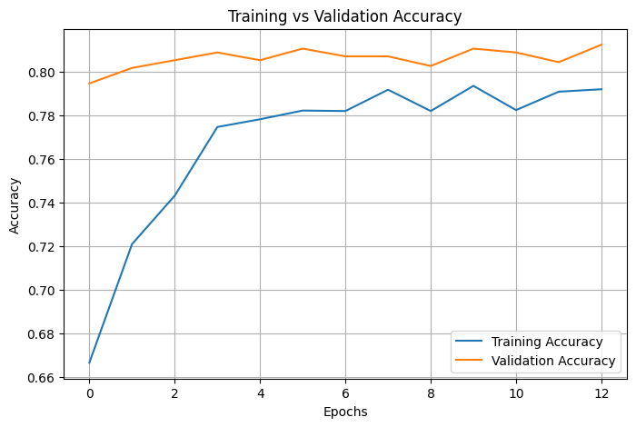
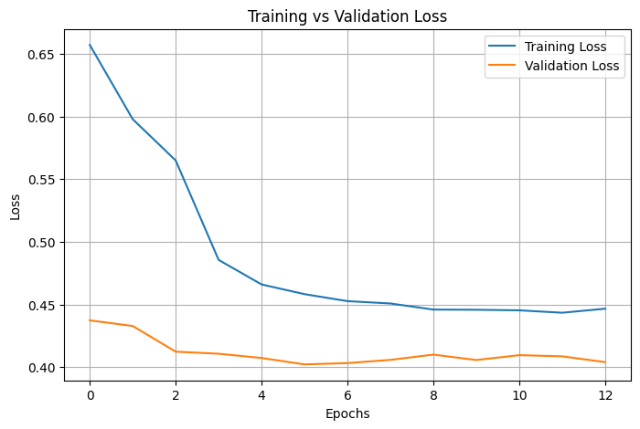

# DeepChurn - Customer Churn Prediction using Deep Learning

## Overview

DeepChurn is a Deep Learning project that predicts whether a telecom customer is likely to churn using an Artificial Neural Network (ANN). The application is built with Python, TensorFlow/Keras, and Streamlit.

The project includes:

- Data preprocessing pipeline
- ANN model training notebooks
- Pretrained model artifacts
- Streamlit web application
- Docker support
- Helm chart for Kubernetes deployment

---

# Project Architecture

```text
User Input → Streamlit App → Data Preprocessing → ANN Model → Prediction Result
```

---

# Features

- Predict customer churn probability
- Interactive Streamlit UI
- TensorFlow/Keras ANN model
- Preprocessing using saved scaler and feature mappings
- Dockerized application
- Kubernetes deployment using Helm
- Easy local development setup

---

# Tech Stack

## Backend & ML

- Python
- TensorFlow / Keras
- Scikit-learn
- Pandas
- NumPy

## Frontend

- Streamlit

## Deployment

- Docker
- Kubernetes
- Helm

---

# Project Structure

```text
deepChurn/
│
├── app/
│   ├── app.py                  # Streamlit application
│   ├── utils.py                # Prediction & preprocessing logic
│
├── models/
│   ├── churn_ann_model.keras   # Trained ANN model
│   ├── scaler.pkl              # Saved scaler
│   ├── feature_columns.pkl     # Training feature columns
│
├── data/
│   ├── WA_Fn-UseC_-Telco-Customer-Churn.csv
│   ├── processed/
│
├── notebooks/
│   ├── eda.ipynb               # Exploratory Data Analysis
│   ├── model_training.ipynb    # Model training notebook
│
├── charts/
│   └── deep-churn/             # Helm chart
│
├── Dockerfile
├── requirements.txt
└── README.md
```

---

# Dataset

The project uses the Telco Customer Churn dataset.

Target column:

- `Churn`

Example features:

- Gender
- SeniorCitizen
- Partner
- Dependents
- Tenure
- InternetService
- Contract
- MonthlyCharges
- TotalCharges

---

# Model Details

The project uses an Artificial Neural Network (ANN) built using TensorFlow/Keras.

## Workflow

1. Load dataset
2. Perform preprocessing
3. Apply one-hot encoding
4. Scale features using StandardScaler
5. Train ANN model
6. Save model and preprocessing artifacts
7. Serve predictions through Streamlit

---
# Key Insights from EDA

- Customers with month-to-month contracts show higher churn.
- Customers with lower tenure are more likely to churn.
- Higher monthly charges are associated with increased churn.
- Long-term contracts reduce churn probability.
- Dataset contains class imbalance.

---
# Measured Metrics for Model training



| Observation                              | Meaning               |
| ---------------------------------------- | --------------------- |
| Training accuracy increasing             | learning progressing  |
| Validation accuracy stable around 80–81% | good generalization   |
| Small gap between curves                 | stable model          |
| No validation collapse                   | no strong overfitting |




| Observation                              | Meaning                  |
| ---------------------------------------- | ------------------------ |
| Training loss decreasing steadily        | model learning           |
| Validation loss also decreasing          | generalization improving |
| No divergence between curves             | no major overfitting     |
| Validation loss lower than training loss | regularization effects   |


---
# Installation

## Clone Repository

```bash
git clone <your-repository-url>
cd deepChurn
```

---

# Create Virtual Environment

## Linux / macOS

```bash
python3 -m venv venv
source venv/bin/activate
```

## Windows

```bash
python -m venv venv
venv\Scripts\activate
```

---

# Install Dependencies

```bash
pip install -r requirements.txt
```

---

# Run the Application

```bash
streamlit run app/app.py
```

Application will start at:

```text
http://localhost:8501
```

---

# Using the Application

1. Open the Streamlit UI
2. Enter customer details
3. Click `Predict Churn`
4. View churn probability and prediction

---

# Docker Deployment

## Build Docker Image

```bash
docker build -t deep-churn:v1 .
```

## Run Container

```bash
docker run -p 8501:8501 deep-churn:v1
```

---

# Kubernetes Deployment

The project includes a Helm chart under:

```text
charts/deep-churn
```

## Install using Helm

```bash
helm install deep-churn charts/deep-churn
```

## Upgrade Release

```bash
helm upgrade deep-churn charts/deep-churn
```

---

# Streamlit Inputs

The application currently accepts the following inputs:

| Feature | Type |
|---|---|
| Gender | Categorical |
| Senior Citizen | Binary |
| Partner | Binary |
| Dependents | Binary |
| Tenure | Numeric |
| Phone Service | Binary |
| Internet Service | Categorical |
| Contract | Categorical |
| Monthly Charges | Numeric |
| Total Charges | Numeric |

---

# Prediction Logic

The application:

1. Converts input into a Pandas DataFrame
2. Applies one-hot encoding
3. Aligns columns with training features
4. Scales the input using saved scaler
5. Runs ANN inference
6. Returns:

- Churn probability
- Final churn prediction

---

# Future Improvements

Possible enhancements:

- Add model evaluation metrics dashboard
- Add model retraining pipeline
- Add explainability using SHAP

# Troubleshooting

## TensorFlow Issues on Apple Silicon

For Apple Silicon Macs:

```bash
pip install tensorflow-macos
pip install tensorflow-metal
```

---

# Requirements

Main libraries used:

```text
tensorflow
streamlit
pandas
numpy
scikit-learn
joblib
```

---

# Learning Objectives

This project helps in understanding:

- End-to-end ML workflow
- ANN implementation
- Feature preprocessing
- Model deployment
- Streamlit applications
- Docker containerization
- Kubernetes deployment

---

# Author

Built as a Deep Learning and MLOps learning project.


